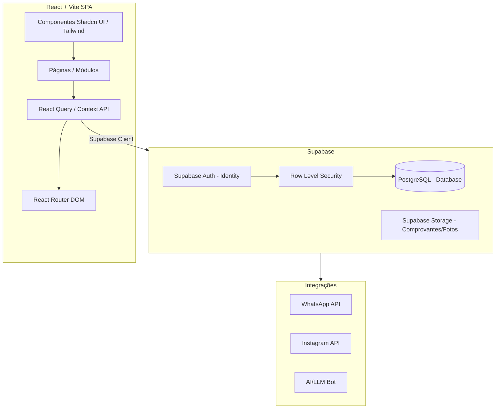

# Project Brain (Architecture & Context)

Este documento é a **fonte primária e canônica de contexto** para o projeto `CellManagerPro` (também conhecido como `phonemanagerpro`). Ele deve ser consultado antes de qualquer nova implementação, correção de bug ou evolução arquitetural, visando manter a consistência, evitar quebras de regras de negócio (invariantes) e economizar tokens/tempo de reanálise. 

Sempre que a arquitetura, modelos de dados ou regras de negócio sofrerem mudanças estruturais, **este arquivo deve ser atualizado**.

---

## 1. Visão Geral do Domínio

O sistema é um **ERP / PDV Multi-loja** focado no nicho de **assistências técnicas e venda de dispositivos (celulares/eletrônicos) e acessórios**.
O software permite a gestão completa da loja, englobando:
- Controle de estoque (aparelhos e acessórios) com rastreamento por IMEI.
- Ponto de Venda (PDV) com múltiplos métodos de pagamento, cálculo de lucro, comissionamento e trade-in (aparelho na troca).
- Fluxo de Caixa (Abertura/Fechamento) e DRE.
- Gestão Financeira (Contas a pagar/receber, conciliação bancária, finanças PF e PJ).
- Ordens de Serviço (OS) com acompanhamento, check-list, peças e galeria de fotos.
- CRM (Leads, integração com WhatsApp/Instagram e IA/Chatbot).
- Gestão de Equipe (Perfis de acesso: Admin, Gerente, Vendedor, Técnico).

### Objetivos Funcionais
- **Gestão Centralizada:** Unificar estoque, vendas e OS.
- **Controle Financeiro Rigoroso:** Garantir que o valor líquido da venda bata com as entradas de caixa e transações bancárias.
- **Auditoria Total:** Registrar logs de qualquer alteração de estado (criação, edição e deleção) em tabelas cruciais.
- **Multitenancy (Multi-loja):** Permitir que um usuário admin gerencie múltiplas lojas (franquias ou filiais) e alterne a visão (`activeStoreId`).

### Objetivos Não-Funcionais
- **Responsividade e Usabilidade:** Uso de componentes rápidos e interface polida (Tailwind, Shadcn UI).
- **Segurança (RLS):** Garantir que usuários de uma loja não enxerguem os dados de outra loja via PostgreSQL Row Level Security (RLS).
- **Resiliência:** Tratamento robusto no frontend para offline fallback ou erros de API.

---

## 2. Diagrama Textual da Arquitetura

---

## 3. Módulos e Responsabilidades

| Módulo (Página) | Arquivo Principal | Responsabilidade |
|-----------------|-------------------|------------------|
| **Vendas / PDV** | `src/pages/Vendas.tsx` | Registro de vendas de aparelhos (tabela `sales`) e acessórios (tabela `transactions`). Lida com trade-in, comissões, múltiplos métodos de pagamento (pix, cartão, dinheiro) e gera recibos (PDF/WhatsApp). |
| **Estoque** | `src/pages/Estoque.tsx` | CRUD de aparelhos (`products`) e acessórios (`accessories`). Status de produtos: `in_stock`, `sold`, `maintenance`. |
| **Caixa** | `src/pages/Caixa.tsx` | Abertura, suprimento, sangria e fechamento de caixa (`cash_registers`, `cash_entries`). Interage diretamente com as vendas para registro de entradas em dinheiro. |
| **Financeiro** | `src/pages/Transacoes.tsx`, `Contas.tsx` | Gestão de `bank_accounts`, conciliação e transações gerais (income, expense). Contas bancárias e taxas de adquirentes (cartão/pix). |
| **Ordens de Serviço** | `src/pages/OrdensServico.tsx` | Criação de OS (`service_orders`), checklist pré/pós, controle de status, adição de peças e aprovação de orçamento. Rota pública para cliente `OSPublica.tsx`. |
| **Clientes e CRM**| `src/pages/Clientes.tsx`, `Leads.tsx` | Gestão da carteira de clientes, captura de leads, integração omnichannel via webhook. |
| **Equipe & Auditoria** | `src/pages/Equipe.tsx`, `Auditoria.tsx` | Criação de usuários (`profiles`), definição de permissões e log detalhado de ações (`audit_logs`). |

---

## 4. Contratos de APIs e Esquemas de Dados (PostgreSQL / Supabase)

### Principais Entidades e Relacionamentos
- **`stores`**: Entidade raiz do Multitenancy. Quase todas as tabelas possuem `store_id`.
- **`profiles`**: Extensão da auth.users. Possui `role` (admin, gerente, vendedor, técnico) e `store_id`.
- **`products`** (Aparelhos): `id`, `name`, `imei`, `cost_price`, `sale_price`, `status`, `store_id`.
- **`accessories`**: Estoque de itens quantificáveis (`quantity`, `min_quantity`).
- **`sales`**: Venda de aparelhos. Relaciona-se com `products`, contém split de pagamentos (`payment_cash`, `payment_card`, `payment_pix`), comissão, dados do cliente e trade-in.
- **`transactions`**: Transações financeiras genéricas e vendas de PDV/acessórios.
- **`cash_registers` & `cash_entries`**: Sessões de caixa diário (abertura/fechamento) e movimentações efetivas em espécie/misto.
- **`service_orders`**: OS de manutenção, vinculada a clientes, aparelhos, técnicos, peças (`service_order_parts`).

### Invariantes e Regras de Negócio Críticas
1. **Multitenancy Estrito**: 
   - Ao renderizar componentes, as *queries* (React Query ou chamadas diretas) **devem** ser filtradas por `store_id`. Se `activeStoreId === "all"`, deve-se omitir o filtro ou buscar sem filtro, mas ao **inserir** dados, o `store_id` real da loja selecionada (ou a loja vinculada ao item) deve ser usado explicitamente. Não é permitido criar registros na raiz se eles requerem vínculo.
2. **Integridade de Venda e Caixa**:
   - A soma de `payment_cash + payment_card + payment_pix + trade_in_value` deve obrigatoriamente ser igual ao `sale_price` (com desconto aplicado).
   - Somente a parte em **dinheiro** (ou misto contendo dinheiro) entra na tabela `cash_entries` para impactar o caixa físico aberto.
3. **Estoque de Aparelhos**:
   - Um `product` (aparelho) é um item único, rastreado por `imei`.
   - Ao vender, seu status muda de `in_stock` para `sold`. Ao excluir a venda, o produto **retorna para `in_stock`** e transações vinculadas devem ser desfeitas.
4. **Trade-in (Aparelho na Troca)**:
   - Aparelhos recebidos na troca entram no estoque (`products`) com o valor da troca como `cost_price`.
5. **Comissionamento**:
   - Vendedores não podem editar sua própria `%` de comissão. Somente Admin/Gerente.

---

## 5. Decisões Arquiteturais (ADRs)

1. **Separação entre `sales` e `transactions`**:
   - **Contexto:** Aparelhos possuem serial number (IMEI), garantia e trade-in (`sales`). Acessórios são itens quantitativos e geram vendas rápidas no PDV (`transactions` com type `income` e category `acessorio`).
   - **Decisão:** Manter duas tabelas separadas para vendas. No frontend, unificar a visualização quando necessário (ex: Aba Vendas combina e ordena ambas por `created_at`).
2. **Uso de React Query e Local State**:
   - **Decisão:** Telas muito complexas (como Vendas) fazem *fetch* direto via `supabase.from()` num `useEffect` por questões de acoplamento legado, porém, novos módulos deverão padronizar usando `@tanstack/react-query` para melhor gerência de cache e loading states.
3. **Row Level Security (RLS)**:
   - **Decisão:** Toda a segurança de isolamento é delegada ao Postgres. O client Supabase logado só consegue ler/escrever dados onde o `store_id` pertença ao escopo autorizado no `profiles`. Admins podem ter `store_id` dinâmico para ver tudo.
4. **Trilha de Auditoria Universal (`audit_logs`)**:
   - **Decisão:** Utiliza-se a função utilitária `logAction(action, table, entity_id, before, after, storeId)` em todos os eventos de CRUD críticos (venda, exclusão, reajuste financeiro) para rastreabilidade de quem fez o quê.

---

## 6. Convenções de Codificação e Padrões

- **Componentização:** Padrão Shadcn UI (`src/components/ui/`). O design deve ser moderno e premium ("wow factor").
- **Estilização:** Tailwind CSS utility classes.
- **Formatação de Moeda:** Utilizar a função utilitária `formatCurrency` ou `Intl.NumberFormat("pt-BR")`.
- **Tratamento de Datas:** `date-fns` ou padrão nativo para o timezone do Brasil.
- **Variáveis de Estado Complexas:** Formulários usam preferencialmente estados agregados `const [form, setForm] = useState({...})` ou `react-hook-form` com `zod`.
- **Modificadores de Deleção:** Operações de deleção devem usar `Alert-Dialog` ou `Dialog` com input de confirmação ou justificativa obrigatória, dependendo da criticidade do dado.

---

## 7. Hotspots Conhecidos e Componentes Sensíveis a Falhas

- **`src/pages/Vendas.tsx`**: Ponto nevrálgico do sistema. Arquivo muito grande (>2500 linhas). Lida com múltiplas origens de dados e conciliação de caixa. Qualquer alteração neste arquivo requer testes cuidadosos no cálculo residual, emissão de PDF (`gerarNotaFiscalInterna`) e rollback manual em caso de falha de Supabase.
- **Sincronização de Caixa (`cash_entries`)**: Se o sistema falhar ao deletar uma venda, o lançamento do caixa **precisa** ser revertido (rollbacks no client-side em vez de stored procedures, requer cuidado com partial success).
- **Filtro Multi-loja (`activeStoreId === "all"`)**: Quando um admin visualiza todas as lojas, operações de CRUD (ex: registrar transação avulsa) podem falhar se a interface não forçar a escolha da loja de destino (`store_id` específico).

---

## 8. Estratégias de Observabilidade e Evolução

- **Logs Frontend**: `utils/logger.ts`, `auditLogger.ts` e painel `DebugPanel` embutido para monitorar hooks do Supabase no ambiente de admin.
- **Evolução Planejada**: 
  - Refatorar `Vendas.tsx` quebrando a UI em subcomponentes (ex: `SaleCard`, `PDVFormModal`).
  - Migrar `useEffect` massivos para Custom Hooks ou `useQuery`.

---

## 9. Changelog e Histórico de Decisões Recentes

Esta seção serve como memória persistente de features implementadas, bugs corrigidos e decisões técnicas tomadas, visando facilitar a manutenção futura sem perda de contexto.

| Data | Tipo | Componente/Arquivo | Descrição e Lógica Implementada |
|------|------|--------------------|---------------------------------|
| 10/07/2026 | `Feature / Fix` | `src/pages/Vendas.tsx` | **Unificação e Ordenação do Histórico de Vendas:** A interface de Vendas exibia separadamente as vendas de celulares (`sales`) e de acessórios do PDV (`transactions`). O usuário solicitou que tudo fosse unificado. **Lógica:** Combinamos os arrays `filteredSales` e `pdvSales` em um array único (`[...pdvSales.map(...), ...filteredSales.map(...)]`), ordenamos descendentemente usando a propriedade `created_at` convertida para timestamp (`date`) e mapeamos a renderização baseada na flag `type === 'pdv' / 'sale'`. |
| 10/07/2026 | `Feature` | `src/pages/Vendas.tsx` | **Deleção de Vendas do PDV:** Administradores precisavam apagar vendas de acessórios diretamente da lista. **Lógica:** Refatoramos a função `handleDeleteSale(item, reason)` e o estado `deleteId` para `deleteItem: { id, type }`. Se for tipo `pdv`, excluímos o registro de `transactions` e localizamos a entrada em `cash_entries` (via campo `description`) para excluí-la simultaneamente, garantindo a consistência do fluxo de caixa e gerando log de auditoria. |

| 10/07/2026 | `Bugfix` | `cash_entries` (Múltiplos) | ~~**REVOGADO**~~ A correção anterior que trocou `cash_register_id` por `register_id` estava **ERRADA**. O `types.ts` gerado pelo Supabase está desatualizado e declara `register_id`, mas o banco real usa `cash_register_id`. Confirmado via REST API: `register_id` retorna `PGRST204: Could not find column`. A correção foi **revertida** e o código agora usa corretamente `cash_register_id` e `store_id` em todas as inserções/consultas de `cash_entries`. |
| 10/07/2026 | `Bugfix` | `Vendas.tsx` e `Caixa.tsx` | **Correção de Lançamentos Órfãos no Caixa:** Usuários relataram que algumas vendas concluídas não geravam lançamentos (`cash_entries`). **Causa Raiz:** Ocorriam falhas silenciosas na inserção de transações financeiras (`transactions`) via `supabase.from().insert` que não lançavam exceções, fazendo com que o código falhasse parcialmente sem mostrar erro na interface. Além disso, o caixa *fallback* selecionado em Vendas quando um vendedor não havia aberto o caixa nem sempre era consistente com o que `Caixa.tsx` exibia. **Solução:** Forçado `throw error` explícito em `insertError` e `txError` para impedir continuidade silenciosa; ampliado a cobertura de testes para simular inserção em caixas não-proprietários e fallback ativo. |
| 10/07/2026 | `Bugfix` | `Vendas.tsx` | **Correção de Constraint em Pagamentos Mistos:** A inserção de vendas com pagamentos mistos falhava ao inserir em `cash_entries` devido à violação da check constraint `cash_entries_payment_method_check` que não aceita o valor `"misto"`. **Solução:** Refatorada a lógica em `handlePdvSubmit` e `handleSaleSubmit` para inserir os valores fracionados do pagamento misto como entradas separadas e individuais em `cash_entries` (`dinheiro`, `pix`, `cartao_credito`), mantendo a transação unificada apenas na tabela `transactions`. A tela de configurações (conciliação) também foi atualizada para processar pagamentos mistos legados. |
| 10/07/2026 | `Tech Debt` | Observabilidade, CI/CD, Testes | **Elevação da Maturidade de Qualidade:** Adicionado **Vitest** e React Testing Library para cobertura de fluxos críticos de negócio; configurado Pipeline de **GitHub Actions** (`ci.yml`) para validar tipagem, linting e testes a cada Pull Request/Push, bloqueando merges inseguros; implementado **Correlation ID (UUID)** anexado ao `logger.ts` e inserido metadados contextuais (User Agent, timestamp da solicitação) nos `audit_logs` (`after_state._meta`) para rastreabilidade de ponta-a-ponta em investigações futuras. O arquivo `Vendas.tsx` permanece mapeado como Hotspot Crítico. |
| 10/07/2026 | `Quality` | Testes (6 suítes, 72 cenários) | **Suíte Completa de Testes de Integração:** Criação de 6 arquivos de teste cobrindo: (1) regras de negócio do Caixa (abertura/lançamento/sangria/fechamento), (2) cálculos de venda (pagamentos/lucro/comissão/trade-in/split), (3) fluxo PDV (carrinho/troco/estoque/deleção), (4) faturamento de OS (cash entries/lookup de caixa/transições de status), (5) validação estática de schema contra todos os arquivos-fonte, (6) fluxo completo de cash_entries (ciclo de dia/relatórios/conciliação/multitenancy). Mock centralizado do Supabase em `src/__tests__/mocks/supabase.ts`. Todos os 72 testes passaram. |
| 11/07/2026 | `Refactor` | Múltiplos Arquivos | **Modularização Completa das Páginas Massivas:** Para reduzir a complexidade técnica e a quantidade de linhas dos arquivos principais de páginas (como `Vendas.tsx`, `OrdensServico.tsx`, `Estoque.tsx`, `Relatorios.tsx`, `Caixa.tsx`), quebramos a lógica e interface em subcomponentes e serviços dedicados: (1) Vendas usa `useVendas`, `salesService`, `PdvFormModal` e `DetalhesVendaModal`; (2) OrdensServico usa `OSCard`, `OSFormModal` e `osService`; (3) Estoque usa `AparelhosTable` e `AcessoriosTable`; (4) Relatorios usa `RelatorioDiarioTab` com memoização de dependências; (5) Caixa usa `SuppliersTab` para encapsular diálogos e visualização de fornecedores. Todos os 74 testes passaram com 0 erros de compilação. |
| 28/08/2026 | `Feature` | `src/pages/OrdensServico.tsx` | **Duplicação de Ordem de Serviço para Orçamento:** Adicionado botão "Duplicar OS" no modal de detalhes da OS. Permite clonar dados do cliente, aparelho, defeito, checklist de entrada e valores para o formulário de Nova OS, facilitando a geração rápida de orçamentos avulsos ou corporativos com nova numeração sequencial. |

---

## 10. Decisões Arquiteturais (ADRs) de Qualidade e Observabilidade

- **ADR-001 (Testes):** Adoção de Vitest + RTL para testes unitários e de integração no ecossistema Vite + React. O objetivo não é atingir 100% de cobertura forçada, mas cobrir lógicas de negócio cruciais (como conciliação de caixa e validação de permissões).
- **ADR-002 (CI/CD):** Uso exclusivo do GitHub Actions para esteiras de integração contínua, visando simplificação operacional e bloqueio preemptivo de regressões sintáticas (via `tsc --noEmit`).
- **ADR-003 (Logging & Correlação):** Todo erro ou ação crítica persistida em `error_logs` e `audit_logs` deve conter um `Correlation ID` e contexto de ambiente (`User Agent`). Isso garante rastreabilidade temporal exata caso uma ação inicie uma cascata de chamadas de rede no Supabase.
- **ADR-004 (Discrepância types.ts vs Banco Real):** O arquivo `src/integrations/supabase/types.ts` gerado automaticamente declara a coluna `register_id` na tabela `cash_entries`, porém o banco PostgreSQL real utiliza `cash_register_id`. O código contorna isso com `as any` casts. **NUNCA** altere o código-fonte para seguir o `types.ts` neste ponto sem antes confirmar via `SELECT column_name FROM information_schema.columns WHERE table_name = 'cash_entries'` no SQL Editor do Supabase. Um teste de regressão (`schema-validation.test.ts`) garante que nenhum arquivo use o nome errado.
- **ADR-005 (Múltiplos Métodos de Pagamento em Vendas):** A constraint `cash_entries_payment_method_check` no banco bloqueia a inserção direta de `payment_method = 'misto'`. Por isso, qualquer venda do PDV ou de Aparelhos com mais de uma forma de pagamento deve gerar **múltiplas linhas** em `cash_entries` (uma para cada método: `dinheiro`, `pix`, `cartao_credito`), mantendo a integridade no banco, mas pode gerar **apenas uma linha** na tabela `transactions` agregada como `MISTO` para fins de exibição e impressão de cupom fiscal.

---

## 11. Diretrizes de UI/UX (Apple Human Interface Guidelines - HIG)

As seguintes regras e convenções de interface do usuário foram adotadas para garantir elegância, clareza e alta usabilidade móvel/desktop:
1. **Navegação Móvel Eficiente (Bottom Tab Bar):**
   - Substituída a navegação móvel de scroll horizontal por uma **Barra de Abas Inferior fixa com exatamente 5 posições**: Dashboard, Vendas, Estoque, OS e "Mais".
   - A aba "Mais" abre um Drawer (gaveta inferior estilo Action Sheet do iOS) contendo as opções adicionais, mantendo a tela organizada e sem sobrecarga cognitiva.
2. **Alvos de Toque (Touch Targets):**
   - Botões, abas e links móveis devem manter uma altura interativa mínima de **44x44 pt** (usar `h-11` no Tailwind) para evitar cliques incorretos.
3. **Resiliência e Profundidade Visual:**
   - Efeitos de transparência e blur de fundo (`backdrop-blur-md bg-card/95`) são utilizados em barras fixas e modais de sobreposição para expressar camadas e profundidade física.
4. **Animações e Micro-Interações:**
   - Adicionada classe utilitária `.active-hig-feedback` para botões com escala elástica (`active:scale-[0.98]`) e curvas de transição de mola.

*(Mantenha este documento atualizado a cada feature relevante criada ou correção feita. Coloque Identificação tambem de data ou commit, para identificar de quaando foi feito a alteração, e sempre que possivel revise esse documento para deixá-lo mais clean, sempre tomando cuidado para nao deletar informações importantes, e sempre alimentando ele com êxito e falhas, aprendizados e tudo que for relevante para o projeto.)*